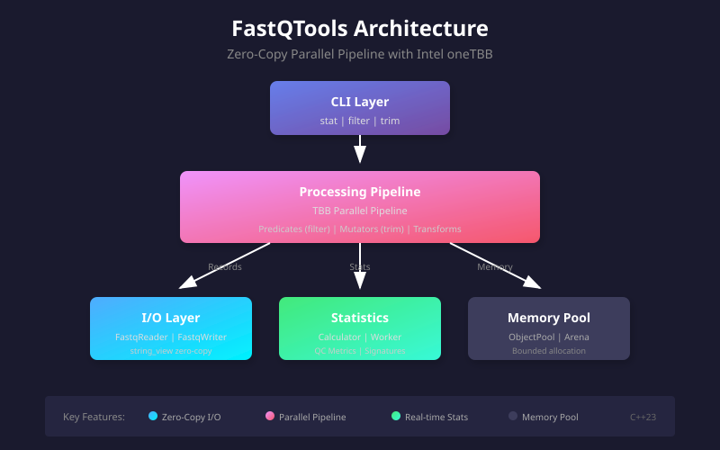

---
hide:
  - navigation
  - toc
---

High-performance FASTQ toolkit for sequencing QC

# FastQTools

Process FASTQ files at 1.7M reads/sec with a CLI for everyday QC and a zero-copy C++ API for pipeline integration.

[Get started](guide/getting-started.en.md){ .md-button .md-button--primary }
[View on GitHub](https://github.com/LessUp/fastq-tools){ .md-button }
[Benchmarks](performance/benchmark-report.md){ .md-button }
[API docs](api/overview.en.md){ .md-button }

Designed for researchers and pipeline engineers who need focused, predictable FASTQ tools built on specifications.

## Three reasons to use it

-   ⚡ **Extreme performance**

    ---

    1.7M reads/sec on standard hardware (AMD Ryzen 5900X). Zero idle overhead between pipeline stages. Built on Intel oneTBB for lock-free parallelism.

-   📖 **Zero-copy design**

    ---

    All record processing uses `std::string_view`. Minimize allocations and page faults when handling large FASTQ files or streaming buffers.

-   📋 **Specification-driven**

    ---

    Every API decision and file format is documented in [`openspec/baseline/`](https://github.com/LessUp/fastq-tools/tree/master/openspec/baseline). Easy to audit, predict, and integrate.

## What you can do

-   :material-chart-box: **Inspect runs in one pass**

    ---

    `FastQTools stat` computes read counts, max read length, total bases, base composition, GC content, quality summaries, and optional lightweight QC sidecars in a single streaming pass.

-   :material-filter-outline: **Filter and trim together**

    ---

    `FastQTools filter` combines quality, length, and N-ratio thresholds, then trims low-quality ends in one tool without intermediate files.

-   :material-code-braces: **Embed in C++ pipelines**

    ---

    Use the public API to reuse the same zero-copy FASTQ primitives inside a larger library or production system.

## Architecture Overview

{ .center }

The pipeline uses Intel oneTBB for lock-free parallelism, with zero-copy `std::string_view` throughout. Records flow from I/O through processing stages without allocation overhead.

## Performance Comparison

| Feature | FastQTools | seqtk | fastp |
|---------|------------|-------|-------|
| **Throughput** | 1.7M reads/s | ~500K reads/s | ~800K reads/s |
| **Memory model** | Zero-copy, bounded pool | Buffer-based | Adaptive |
| **Parallelism** | TBB pipeline (auto-scale) | Single-threaded | Multi-threaded |
| **QC sidecar** | ✅ Built-in | ❌ | ✅ HTML report |
| **Quality trimming** | ✅ AVX2 optimized | ✅ Basic | ✅ Built-in |
| **Adapter trimming** | ✅ | ❌ | ✅ Auto-detect |
| **Signature stats** | ✅ k-mer signatures | ❌ | ❌ |
| **C++ API** | ✅ Public headers | ❌ | ❌ |
| **Spec-driven** | ✅ Full baseline | ❌ | ❌ |

!!! note "Benchmark conditions"
    AMD Ryzen 9 5900X, 100K reads × 150bp, single-threaded read/write, parallel processing.

## Quick stats

| Operation | Speed | Cores |
|-----------|-------|-------|
| FASTQ read | 1696 MB/s | 1× |
| FASTQ write | 1.76M reads/s | 1× |
| Full stat pass | 302 MB/s | parallel |
| Combined filter | 1.67M reads/s | parallel |

See [full benchmarks](performance/benchmark-report.md) for methodology and hardware details.

## Choose your path

| I want to… | Start here |
| --- | --- |
| Build and run the first command | [Getting Started](guide/getting-started.en.md) |
| See command syntax and examples | [CLI Reference](guide/cli-reference.en.md) |
| Understand the benchmark methodology | [Benchmark Overview](performance/benchmark-report.md) |
| Integrate the library in C++ | [API Overview](api/overview.en.md) |
| Work on the project | [Developer Guide](dev/index.en.md) |

## Why specifications matter

FastQTools is **specification-driven** from the ground up. Every public API, file format decision, and performance guarantee is documented in version-controlled specifications. This means:

- **Easy to audit**: No hidden behavior. Read [`openspec/baseline/api/`](https://github.com/LessUp/fastq-tools/tree/master/openspec/baseline/api) for the exact API contract.
- **Easy to extend**: Proposals go in [`openspec/changes/`](https://github.com/LessUp/fastq-tools/tree/master/openspec/changes). Reviewers can see the impact before code is written.
- **Easy to maintain**: Archived decisions in [`openspec/archive/`](https://github.com/LessUp/fastq-tools/tree/master/openspec/archive). No re-discovering the "why" of old choices.

---

  <a href="index.en.md">English</a> ·
  <a href="https://github.com/LessUp/fastq-tools">GitHub</a> ·
  <a href="https://github.com/LessUp/fastq-tools/blob/master/LICENSE">MIT License</a>

