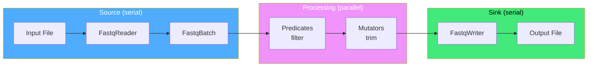

# Architecture

FastQTools is designed around three core principles: **zero-copy processing**, **parallel pipeline execution**, and **specification-driven development**.

## Zero-Copy Design

All record processing uses `std::string_view` to avoid unnecessary allocations:

```cpp
for (auto record : fq::io::Reader("reads.fastq")) {
  std::string_view header = record.header();
  std::string_view sequence = record.sequence();
  std::string_view quality = record.quality();
  // Process without copying
}
```

This design minimizes:
- Memory allocations
- Page faults
- Cache misses

---

## Parallel Pipeline

FastQTools uses Intel oneTBB `tbb::parallel_pipeline` for lock-free parallelism:



The pipeline automatically scales to available cores, with minimal idle overhead between stages.

---

## Module Structure

| Module | Purpose |
|--------|---------|
| `fq::io` | FASTQ I/O with batch processing and zero-copy record views |
| `fq::processing` | Filtering, trimming, and parallel pipeline |
| `fq::statistics` | Statistical computation logic |

---

## Specification-Driven

Every API decision and file format is documented in version-controlled specifications:

- `openspec/baseline/api/` — API contracts
- `openspec/baseline/architecture/` — Architecture decisions
- `openspec/baseline/schemas/` — Data schemas

This ensures:
- No hidden behavior
- Easy to audit and extend
- Predictable integration