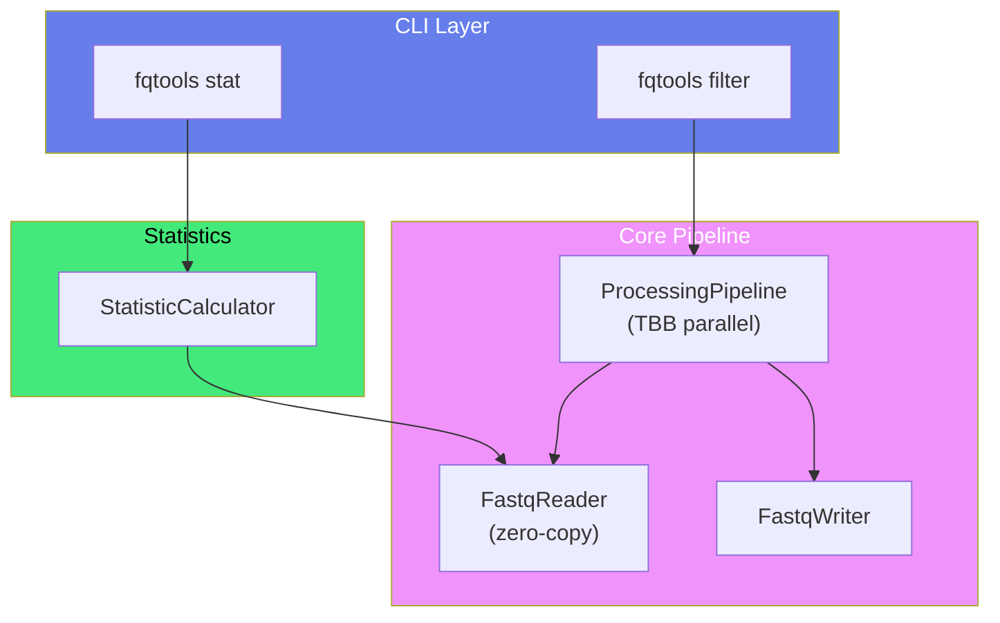

import { Hero } from '../../components/Hero'
import { CodeShowcase } from '../../components/CodeShowcase'
import { FeatureGrid } from '../../components/FeatureCard'
import { Zap, Database, Target, Cpu, Shield, ArrowRight } from 'lucide-react'

export default function HomePage() {
  const stats = [
    { value: '1.7M', label: 'Reads per second', color: 'text-blue-600 dark:text-blue-400' },
    { value: 'Zero-copy', label: 'String view design', color: 'text-purple-600 dark:text-purple-400' },
    { value: 'C++23', label: 'Modern standard', color: 'text-green-600 dark:text-green-400' },
  ]

  const codeTabs = [
    {
      label: 'Statistics',
      code: `# Get FASTQ statistics
fqtools stat -i reads.fastq

# Output includes:
# - Read count, max length, total bases
# - GC content, quality summaries
# - Optional QC sidecar file`
    },
    {
      label: 'Filter',
      code: `# Filter and trim in one pass
fqtools filter -i reads.fastq -o filtered.fastq \\
  --min-length 50 \\
  --min-quality 20 \\
  --trim-quality 15

# Combined filtering without intermediate files`
    },
    {
      label: 'C++ API',
      code: `#include <fqtools/io.hpp>

// Zero-copy FASTQ reading
for (auto record : fq::io::Reader("reads.fastq")) {
  std::string_view seq = record.sequence();
  std::string_view qual = record.quality();
  // Process without allocation
}`
    }
  ]

  const features = [
    {
      icon: Zap,
      iconColor: 'bg-yellow-500',
      title: 'Extreme Performance',
      description: '1.7M reads/sec on standard hardware. Intel oneTBB lock-free parallel pipeline.',
      href: '/fastq-tools/en/performance/benchmark'
    },
    {
      icon: Database,
      iconColor: 'bg-blue-500',
      title: 'Zero-Copy Design',
      description: 'All record processing uses std::string_view. Minimize allocations and page faults.',
      href: '/fastq-tools/en/core-concepts/architecture'
    },
    {
      icon: Target,
      iconColor: 'bg-red-500',
      title: 'Specification-Driven',
      description: 'Every API decision documented in OpenSpec. Easy to audit, predict, and integrate.',
      href: '/fastq-tools/en/core-concepts/architecture'
    },
    {
      icon: Cpu,
      iconColor: 'bg-bio-500',
      title: 'QC Statistics',
      description: 'Compute read counts, GC content, quality summaries in a single streaming pass.',
      href: '/fastq-tools/en/getting-started/cli-usage'
    },
    {
      icon: Shield,
      iconColor: 'bg-purple-500',
      title: 'Filter & Trim',
      description: 'Combine quality, length, N-ratio thresholds and trim low-quality ends in one tool.',
      href: '/fastq-tools/en/getting-started/cli-usage'
    },
    {
      icon: ArrowRight,
      iconColor: 'bg-indigo-500',
      title: 'C++ API',
      description: 'Public headers for zero-copy FASTQ primitives. Embed in your pipeline.',
      href: '/fastq-tools/en/api/overview'
    }
  ]

  return (
    <>
      <Hero
        title="FastQTools"
        subtitle="High-Performance FASTQ Processing Toolkit"
        description="Process FASTQ files at 1.7M reads/sec with a CLI for everyday QC and a zero-copy C++ API for pipeline integration"
        primaryCta={{ text: 'Get Started', href: '/fastq-tools/en/getting-started/quickstart' }}
        secondaryCta={{ text: 'GitHub', href: 'https://github.com/LessUp/fastq-tools' }}
        stats={stats}
      />

      <CodeShowcase
        title="Simple Yet Powerful"
        tabs={codeTabs}
      />

      <FeatureGrid
        title="Why FastQTools?"
        features={features}
      />
    </>
  )
}

## Architecture Overview

FastQTools uses a zero-copy parallel pipeline architecture built on Intel oneTBB:

The pipeline uses Intel oneTBB for lock-free parallelism, with zero-copy `std::string_view` throughout.

## Performance Comparison

| Feature | FastQTools | seqtk | fastp |
|---------|------------|-------|-------|
| **Throughput** | 1.7M reads/s | ~500K reads/s | ~800K reads/s |
| **Memory Model** | Zero-copy | Buffer-based | Adaptive |
| **Parallelism** | TBB pipeline | Single-threaded | Multi-threaded |
| **C++ API** | ✅ | ❌ | ❌ |

*Benchmark: AMD Ryzen 9 5900X, 100K reads × 150bp*

## Open Source & MIT Licensed

FastQTools is released under the **MIT License**.

Built on C++23 standard with Intel oneTBB for parallelism.

- [GitHub Repository](https://github.com/LessUp/fastq-tools)
- [Contributing](/fastq-tools/en/development/contributing)
- [Download Latest](https://github.com/LessUp/fastq-tools/releases/latest)
